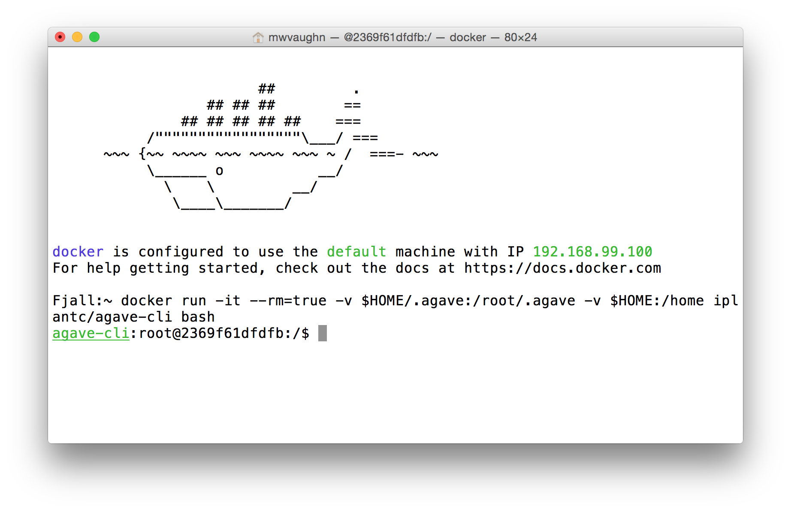

Setting up your environment
---------------------------

**Preparing to use Docker**

First, open **two** UNIX terminal windows, each with access to Docker. The way you do this varies by platform:

1. If you are on **Mac or Windows and using Kitematic**, click the **[DOCKER CLI]** button two times.
2. If you are on **Mac or Windows using Docker Toolbox**, click the Docker Quickstart Terminal icon twice to launch the two windows
3. If you are on **Linux with Docker installed natively**, open two terminal sessions
4. If you are on **Mac or Windows using a VM to run Linux**, follow Linux-native instructions entirely within your VM

**Launching an Agave CLI container**

Choose one (but not both) of your Docker-enabled terminal sessions. Enter the following text exactly:

``docker run -it --rm=true -v $HOME/.agave:/root/.agave -v $HOME:/home iplantc/agave-cli bash``

This launches a container running the latest release of the iPlant flavor of the ``agave-cli``. It mounts Agave's local "cache" directory and also mounts **your local home directory** under ``/home`` inside the container. Check the contents of ``/home`` to verify that you can see your own files and folders.

Set up your Agave environment
-----------------------------

In your **agave-cli** window, run the following command: ``auth-check``. If you get an error **Please run /usr/local/agave-cli/bin/tenants-init to initialize your client before attempting to interact with the APIs** then do the following:

.. code-block:: bash

    # Set up the CLI to point to iPlant
    tenants-init -t iplantc.org
    # Create an OAuth2 API client at iPlant.
    # You will be prompted for your iPlant username and password
    clients-create -S -N agave-cli -D "Agave CLI"
    # Create and cache an Agave API access token
    # You will be prompted for your iPlant password
    auth-tokens-create -S

If you do not get an error from ``auth-check``, please run ``auth-tokens-refresh -S`` before proceeding with the next parts of the workshop.

Retrieving your AWS credentials
-------------------------------

The iPlant team has created a set of credentials for each workshop attendee and stored it in the `Agave document store <http://preview.agaveapi.co/documentation/tutorials/metadata-management-tutorial/>`_. In the next steps, you will retrieve that information yo can use it later. If you have your own AWS credentials you'd prefer to use, talk to the instructors and we'll get you set up.

**Query the iPlant Agave metadata service**

In the **agave-cli** window, enter the following command, **substituting IPLANT_USERNAME with your own iPlant username**. Pay careful attention to the use of single and double quotes!

``metadata-list -v -Q '{"name":"iplant-aws.dib-0923.IPLANT_USERNAME"}'``

You should get a response back that looks like this (abbreviated) JSON document:

.. code-block:: json

    [
    {
        "_links": {
            "self": {
                "href": "https://agave.iplantc.org/meta/v2/data/0001442525546151-e0bd34dffff8de6-0001-012"
            }
        },
        "associationIds": [],
        "created": "2015-09-17T16:32:26.151-05:00",
        "internalUsername": null,
        "lastUpdated": "2015-09-17T16:32:26.151-05:00",
        "name": "iplant-aws.dib-0923.IPLANT_USERNAME",
        "owner": "vaughn",
        "schemaId": null,
        "uuid": "0001442525546151-e0bd34dffff8de6-0001-012",
        "value": {
            "apikeys": {
                "key": "AMWIM3BEAT3BEAWT3BEA",
                "secret": "yfP3ylcmq6Syp6Syp6VPIjHxCT5v66VPIjHOTxXa"
            }
        }}]

This document contains every detail you need to interact with iPlant's AWS account. Let's take a minute to learn how to pull key bits out for use in scripting. We will use the `jq <https://stedolan.github.io/jq/tutorial/>`_ parser, which is installed by default in the iPlant **agave-cli** image.

Change into /home in the container, then pipe the document out to a file.

``cd /home && metadata-list -v -Q '{"name":"iplant-aws.dib-0923.IPLANT_USERNAME"}' > my-aws-creds.json``

The JSON file **my-aws-creds.json** contains an array consisting of one object with several keys. Some of those keys have children. Here's how to use **jq** to extract the *iam_user*, which is your AWS username, from the document:

``jq -r .[0].value.identity.iam_user my-aws-creds.json``

You should get back ``IPLANT_USERNAME.iplantc.org``

**Exercises:**

1. Find your AWS key and secret
2. Find the name of the S3 bucket you have been assigned
3. Find out who is the *owner* of the JSON document that was shared with you
4. What is the *uuid* of the document?
5. Bonus: Use ``metadata-pems-list UUID`` to find out if anyone else has read permission on this document

Check out the workshop material from Github
-------------------------------------------

The iPlant team has prepared several useful utility files and scripts to help with the objectives of the workshop. In the **agave-cli** window:

1. cd into **/home**
2. check out the repository ``git checkout https://github.com/iPlantCollaborativeOpenSource/Advanced_iPlant``
3. ``cd Advanced_iPlant``

**You will be working out of this directory exclusively for the rest of the workshop.**

Navigation:

- `Setting up your environment <02-ho-setup.rst>`_
- **NEXT** `Using AWS S3 for storage with Agave <03-ho-s3-storage.rst>`_
- `Using AWS EC2 for computing with Agave <04-ho-ec2-setup.rst>`_
- `Creating Agave applications and running jobs <05-ho-ec2-using.rst>`_
- `Example 1: Cloud Runner <06-cloud-runner.rst>`_
- `Example 2: An Autoscaling Cluster <07-cfncluster.rst>`_
- `Home <00-Hands-On.rst>`_
