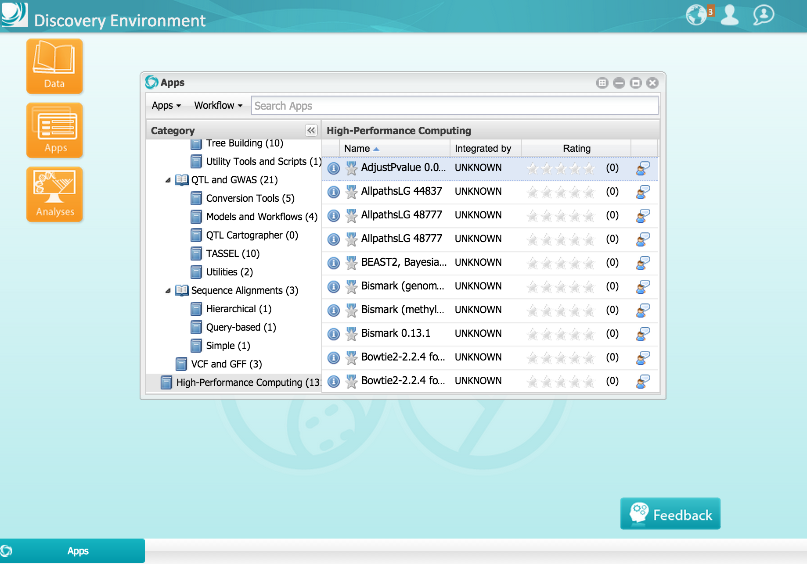
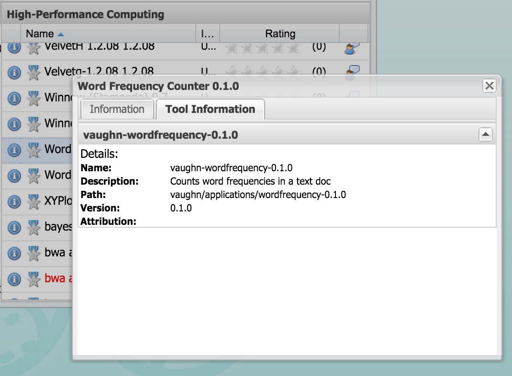
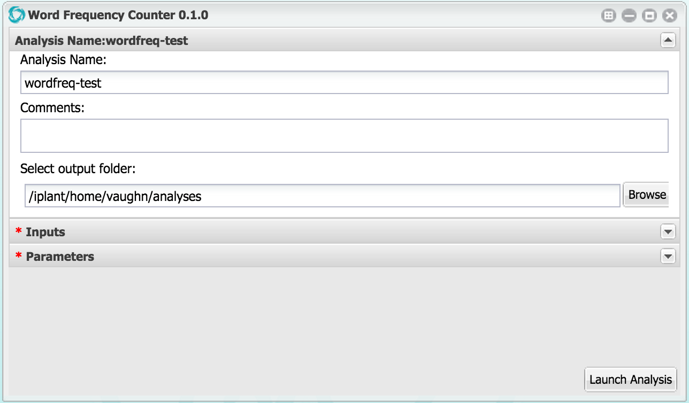
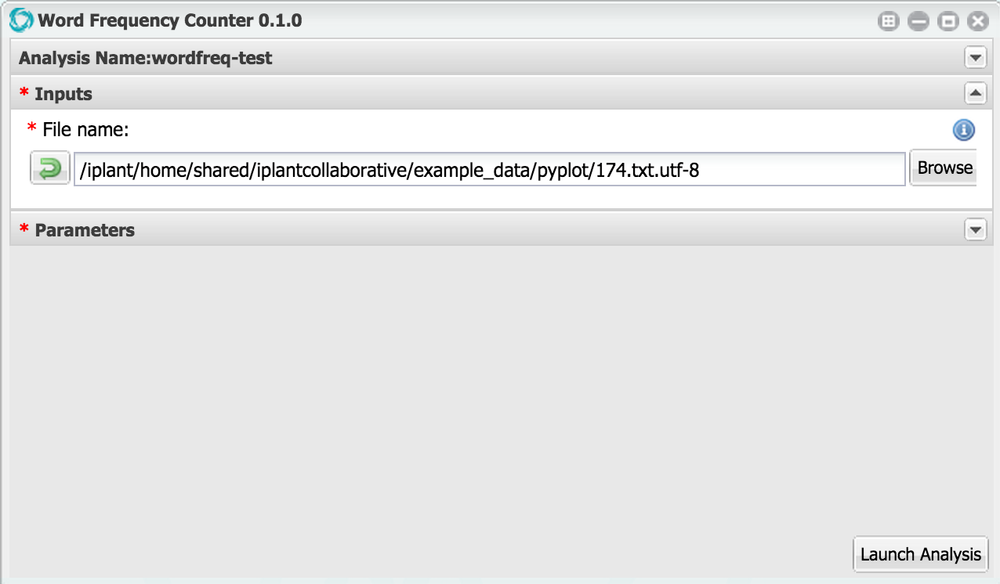
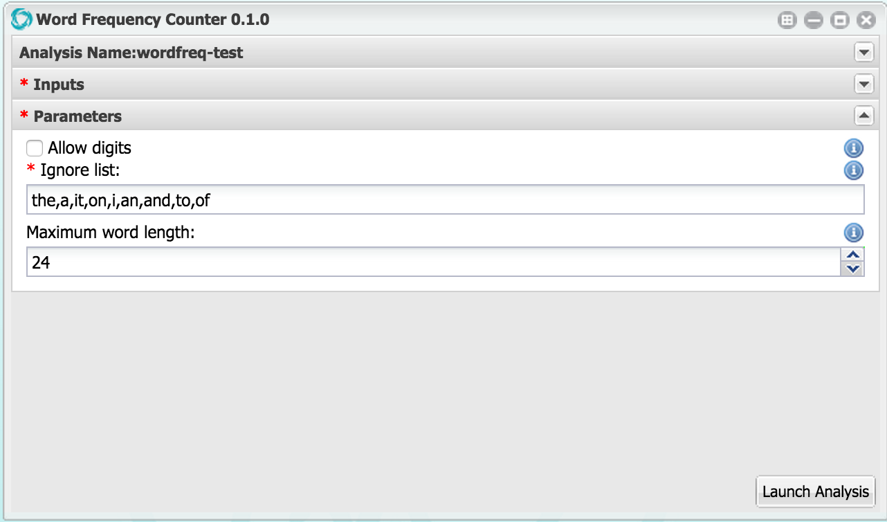
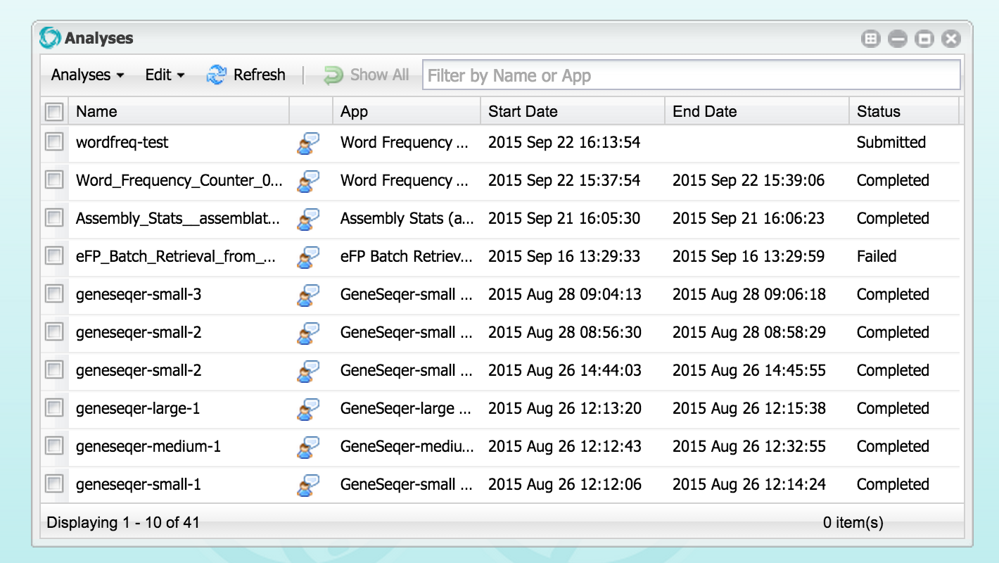

Synergy with the iPlant Discovery Environment
=============================================

Browse private, shared, and public applications

Find out information about specific applications

Launch an instance of an application via automatically generated user interface.
Here, one names the computing task and provides optional comments

Browse and select input files

Specify parameters based on the application description

Once launched, monitor progress via the Analyses window

When the job is done, interactively browse and share right in the DE

.. image:: media/de-05-outputs.png

- `Setting up your environment <02-ho-setup.rst>`_
- `Using AWS S3 for storage with Agave <03-ho-s3-storage.rst>`_
- `Using AWS EC2 for computing with Agave <04-ho-ec2-setup.rst>`_
- `Discovering and using Agave Applications <05-ho-ec2-using.rst>`_
- `Creating and using Agave applications <06-ho-make-app.rst>`_
- `Synergy with the iPlant Discovery Environment <07-ho-discoenv.rst>`_
- **NEXT** `Home <00-Hands-On.rst>`_
- `Example 1: Cloud Runner <20-cloud-runner.rst>`_
- `Example 2: An Autoscaling Cluster <21-cfncluster.rst>`_
- `Troubleshooting <99-ho-troubleshoot.rst>`_
